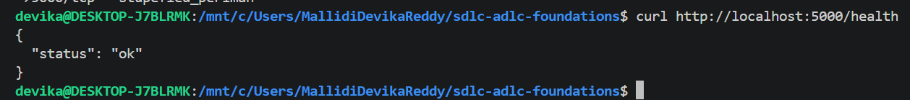
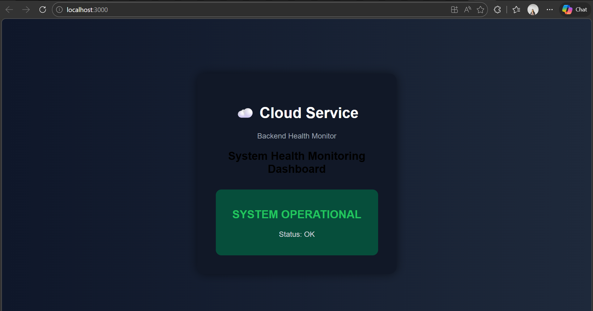

# Week 3 Smoke Test Report

## Objective
Validate that frontend and backend services are running correctly in Docker containers.

---

## Test 1: Backend Health Check

Command:
curl http://localhost:5000/health

Output:
{"status": "ok"}

Status: ✅ PASS

---

## Test 2: Frontend UI Load

URL:
http://localhost:3000

Result:
- UI loaded successfully

Status: ✅ PASS

---

## Test 3: Frontend-Backend Integration

Result:
"Backend Status: ok" displayed on UI

Status: ✅ PASS

---

## Screenshots

### Backend Health

### Frontend UI

---

## Conclusion

All services are working and integrated successfully.